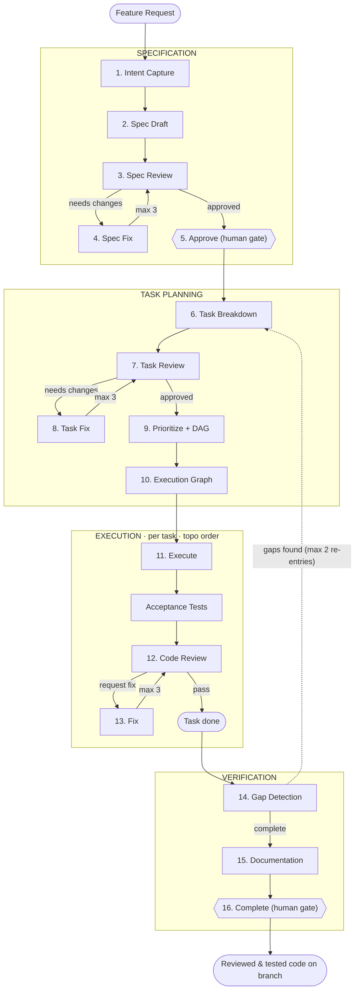

# xpatcher

Spec-driven development automation: a 16-stage pipeline with review loops, self-correction, and human-gated checkpoints, orchestrated by a Python dispatcher that drives Claude Code subagents to turn a feature request into reviewed, tested, and documented code.

What happens when you run it:

1. **Intake** — parses your feature request into a structured goal, scope, and constraints
2. **Specification** — drafts a detailed implementation plan, then a separate agent reviews and challenges it
3. **Task breakdown** — splits the approved spec into small, independently executable tasks with acceptance criteria
4. **Execution** — implements each task: writes code, creates tests, commits to a feature branch
5. **Quality checks** — runs acceptance tests, performs adversarial code review, fixes issues in a loop
6. **Gap detection** — compares what was built against the original spec; creates new tasks for anything missing
7. **Documentation and completion** — updates project docs, produces a summary, and awaits final human sign-off

All pipeline state and artifacts are stored under `$XPATCHER_HOME/.xpatcher/`, keeping the target repository clean — only the actual code changes, commits, and branches land there.

## Pipeline



### Agents

| Agent | Model | Stages | Role |
|-------|-------|--------|------|
| Planner | Opus (1M) | 1, 2, 4, 6, 8 | Requirements, specs, task decomposition |
| Reviewer | Opus | 3, 7, 12 | Adversarial review (isolated from executor) |
| Executor | Sonnet | 11, 13 | Code implementation and fixes |
| Gap Detector | Opus | 14 | Spec-to-code completeness analysis |
| Tech Writer | Sonnet | 15 | Documentation updates |
| Dispatcher | Python | 5, 9, 10, 16 | Orchestration, DAG scheduling, gates |

### Self-Correction Limits

| Loop | Max | On Limit |
|------|-----|----------|
| Spec review (3-4) | 3 | Escalate to human |
| Task review (7-8) | 3 | Escalate to human |
| Quality loop (12-13) | 3 | Mark task stuck, continue |
| Gap re-entry (14-6) | 2 | Escalate to human |

Oscillation detection: if the same findings recur across iterations, escalate immediately rather than burning remaining iterations.

## Requirements

- Python 3.10+
- Claude Code CLI installed and authenticated
- A git repository to run pipelines against

## Authentication

xpatcher uses `claude --bare` for all agent invocations, which requires explicit credentials. Two methods are supported (checked in this order):

**1. API key** — add to `$XPATCHER_HOME/.env`:

```
ANTHROPIC_API_KEY=sk-ant-api03-...
```

Also accepted via the `ANTHROPIC_API_KEY` environment variable.

**2. Claude subscription (Pro/Max/Team/Enterprise)** — if no API key is found, xpatcher extracts the OAuth token from your logged-in Claude Code session (macOS Keychain or `~/.claude/.credentials.json`). Just run `claude` interactively once to log in.

The installer and `xpatcher start`/`resume` will fail fast with a clear error if neither method resolves.

## Install

Local editable-style usage:

```bash
python -m venv .venv
. .venv/bin/activate
pip install -e .
```

Installer-based usage:

```bash
./install.sh
```

The installer sets up a per-user installation under `$XPATCHER_HOME` or `~/xpatcher` by default.

## Usage

From a target project repository:

```bash
# Inline description
xpatcher start "Add a farewell helper with tests"

# From a PRD or requirements file
xpatcher start --file prd.md

# From stdin
cat requirements.txt | xpatcher start
```

Other supported commands:

```bash
xpatcher resume <pipeline-id>
xpatcher status [pipeline-id]
xpatcher list
xpatcher cancel <pipeline-id>
xpatcher skip <pipeline-id> <task-id>[,<task-id>...]
xpatcher pending
xpatcher logs <pipeline-id> [--agent executor] [--task task-001] [--tail 50]
```

## Development

Run tests:

```bash
pytest -q
```

Project layout:

- `src/dispatcher/`: dispatcher runtime, CLI, state machine, session handling, schemas
- `src/context/`: prompt construction and context helpers
- `src/artifacts/`: artifact persistence
- `.claude-plugin/`: Claude Code agents, hooks, and skills (product deliverables)
- `docs/`: architecture snapshot and reference docs
- `tests/`: unit, contract, and integration-style tests

## Notes

- Runtime pipeline state is stored under `$XPATCHER_HOME/.xpatcher/`, not inside the target repository.
- The target project will still be modified by the actual implementation work, git branches, and commits, but not by xpatcher pipeline artifact files.
- Pipeline lookup indices are stored as per-project YAML files under `$XPATCHER_HOME/.xpatcher/pipelines/`, one file per target project.
- The default pipeline is automation-first: specification confirmation and completion review are auto-approved unless configuration or ambiguity requires a human gate.

## Author

Greg Z. — [info@extractum.io](mailto:info@extractum.io) — [LinkedIn](https://www.linkedin.com/in/gregzem/)

## License

MIT. See [LICENSE](LICENSE).
